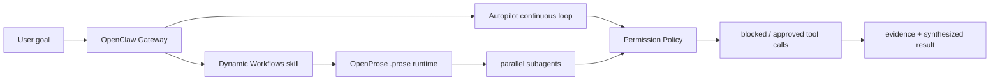

**English** | [简体中文](README.md)

Single-maintainer · WIP · OpenClaw host-integration stack

# oh-my-matrix (omm)


[](LICENSE)
[](https://github.com/TeFuirnever/oh-my-matrix/actions/workflows/ci.yml)
[](https://www.npmjs.com/package/@oh-my-matrix/autopilot)
[](https://github.com/TeFuirnever/oh-my-matrix/releases)
[](https://deepwiki.com/TeFuirnever/oh-my-matrix)

**Turning OpenClaw into a sustainable autonomous-agent runtime stack.**

oh-my-matrix serves OpenClaw hosts and integrators with three capabilities:

- **Autopilot**: long-horizon continuous task execution — with goals, retries, stall detection, evidence gates, and state projection.
- **Dynamic Workflows**: an AI generates `.prose` multi-agent orchestration programs from natural language, executed by OpenProse for fan-out / pipeline / adversarial verification.
- **Permission Policy**: `before_tool_call` runtime safety primitives, shared by autopilot and workflow subagents.

It is not an end-user CLI, nor a standalone SaaS. It is a plugin / skill source repository for OpenClaw hosts to load, package, and validate. The root repo version is `0.8.0`; core package versions live in each `packages/*/package.json`.

> Current maturity: WIP. The `@oh-my-matrix/*` packages are published to npm (public); `@oh-my-matrix/autopilot`, as a hosted plugin of an OpenClaw host, still requires an internal refresh / vendoring flow to deploy to a consuming host. This README does not use unverified stars, download counts, or user testimonials as evidence of maturity.

## Why it exists

A single agent can complete one reply. Real long-horizon development needs three things:

1. **Persistence**: a task returns to its goal across turns, tool errors, and retries.
2. **Parallelism**: a large task can split into multiple subagent branches that converge into one result.
3. **Boundaries**: subagents and automated loops must be guarded at runtime, not constrained by prompts alone.

omm breaks these three into verifiable OpenClaw modules rather than a black-box automation script.

## Module matrix

| Module | What it does | Current status | Path |
|---|---|---:|---|
| `@oh-my-matrix/autopilot` | Continuous-execution plugin. Manages goals, state machine, retry queue, stall detection, token budget, evidence gates, projection, `WORKFLOW.md` config, and 11 OpenClaw hooks | ✅ source hosted, tests present | [`packages/autopilot/`](packages/autopilot/) |
| `@oh-my-matrix/dynamic-workflows` | Workflow-subagent runtime guard. Registers `before_tool_call` at priority 11, fail-closed blocking of dangerous operations for `:subagent:` sessions | ✅ shipped source | [`packages/dynamic-workflows/`](packages/dynamic-workflows/) |
| `@oh-my-matrix/permission-policy` | Shared permission primitives. Provides `classifyCommand`, `decidePermission`, `decidePermissionForEvent`, and audit persistence | ✅ shipped source | [`packages/permission-policy/`](packages/permission-policy/) |
| `dynamic-workflows` skill | Teaches the agent when to generate `.prose`, how to choose among 8 orchestration patterns, and how to verify and aggregate results | ✅ shipped skill | [`packages/dynamic-workflows/skill/`](packages/dynamic-workflows/skill/) |
| Legacy v0.x team/MCP implementation | Early design and implementation records, removed, no longer the current runtime surface | 📦 archived | [`docs/archive/`](docs/archive/) |

## Architecture




### Autopilot: long-horizon continuous execution

`@oh-my-matrix/autopilot` is an OpenClaw-native continuous-execution plugin. It is not a footnote capability in the README but a first-class module of the current repo:

- hook surface: `before_agent_finalize`, `agent_end`, `after_tool_call`, `before_compaction`, `after_compaction`, `session_start`, `session_end`, `agent_turn_prepare`, `before_agent_run`, `before_tool_call`, `llm_output`
- state: `idle` / `running` / `paused` / `done`
- orchestration: claimed workspace, retry queue, stall timeout, evidence lifecycle, blocked reason
- config: `WORKFLOW.md` front matter via `loadWorkflowConfig`
- projection: compact status / evidence / retry / workflow-config summary for the host UI

Verification entry point:

```bash
pnpm --filter @oh-my-matrix/autopilot test
```

### Dynamic Workflows: multi-agent orchestration

`packages/dynamic-workflows/skill/SKILL.md` lets the agent generate `.prose` programs from a task and hand them to OpenProse for execution. It covers 8 patterns:

- fan-out-reduce
- pipeline
- adversarial-verify
- loop-until-dry
- routing
- tournament
- generate-and-filter
- duel-loop

Such workflows suit 10+ file audits, cross-validation, parallel research, and multi-option evaluation. Make small changes directly; do not launch a workflow for them.

### Permission Policy: runtime boundary

`@oh-my-matrix/permission-policy` is the shared safety layer for autopilot and dynamic workflows. It classifies shell/tool operations, writes audits, and lets `@oh-my-matrix/dynamic-workflows` apply `defaultDeny` to workflow subagents.

Currently it blocks:

- destructive git: `reset --hard`, force push, `clean`, history rewrite
- workspace cleanup: `rm`, `rmdir`, `find -delete`
- credential / system write
- shell substitution / process substitution
- wrapper exec: `npx`, `pnpm exec`, etc.

Known limitations remain a public fact: tokenize-based, not a full shell parser. Redirect-based file writes, unknown non-shell-framework tools, and false positives on operators inside quotes — see [`docs/fixes/runtime-guard-event-shape.md`](docs/fixes/runtime-guard-event-shape.md).

## Onboarding instructions for agents

If you are an AI agent integrating omm into an OpenClaw host, read in this order:

1. [`CONTEXT.md`](CONTEXT.md): the domain language of this project.
2. [`docs/architecture.md`](docs/architecture.md): the three-module architecture.
3. [`docs/adr/010-autopilot-source-hosting.md`](docs/adr/010-autopilot-source-hosting.md): why autopilot is hosted in this repo.
4. [`docs/adr/012-dynamic-workflows-plugin-extraction.md`](docs/adr/012-dynamic-workflows-plugin-extraction.md) and [`docs/adr/013-permission-policy-library.md`](docs/adr/013-permission-policy-library.md): the split between the guard and the permission policy.
5. [`packages/dynamic-workflows/skill/SKILL.md`](packages/dynamic-workflows/skill/SKILL.md): how the runtime agent should generate workflows.

Before changing code, run the relevant tests:

```bash
pnpm --filter @oh-my-matrix/autopilot test
pnpm --filter @oh-my-matrix/dynamic-workflows test
pnpm --filter @oh-my-matrix/permission-policy test
pnpm docs:build
```

Host deployment is outside this repo. After source changes, an internal host-deploy / bundled-plugin refresh is still needed for the OpenClaw Gateway to load the new dist.

## Local development

```bash
pnpm install          # also installs the local commit-msg hook

# Before pushing: run the full local CI mirror (recommended)
pnpm verify           # eslint + markdownlint + typecheck + all workspace tests + docs build
pnpm check            # static gates only (eslint + markdownlint + typecheck)

# Run docs or a single package
pnpm docs:dev
pnpm --filter @oh-my-matrix/autopilot test
```

Commits must follow Conventional Commits (enforced by both a local hook and CI). For the full multi-gate harness and how to add a gate, see [`CONTRIBUTING.md`](CONTRIBUTING.md), the `harness` skill, and [`docs/design/dev-harness.md`](docs/design/dev-harness.md).

## Publishing to npm (maintainer)

After bumping the version in `packages/<pkg>/package.json`, publish from **your own terminal** (not Claude's `!`):

```bash
pnpm --filter @oh-my-matrix/autopilot publish --access public
pnpm --filter @oh-my-matrix/dynamic-workflows publish --access public
pnpm --filter @oh-my-matrix/permission-policy publish --access public
```

- **Keep 2FA on**: the `@oh-my-matrix` org requires publishers to have 2FA; disabling it gets you E403-locked. npm prompts for OTP interactively (read the 6-digit code from your authenticator app).
- **Run from your own terminal**: Claude's `!` + `--otp=` is fragile (OTP 30s window + permission classifier); local interactive is smoothest.
- **No re-publishing the same version**: npm versions are immutable; changed content requires a bump (even a patch). `pnpm --filter <pkg> pack` previews the tarball.

## Project status

| Item | Status |
|---|---|
| Root public release | v0.8.0 (GitHub Release) |
| npm public package | published `@oh-my-matrix/*` (permission-policy 0.1.0 / autopilot 2.1.1 / dynamic-workflows 0.1.1) |
| CI / Harness | GitHub Actions, 4 gates (lint / typecheck / commitlint / test) + local `pnpm verify` mirror |
| Dependency scanning | Dependabot enabled (`.github/dependabot.yml`) |
| Docs site | https://tefuirnever.github.io/oh-my-matrix/ — hand-drawn landing (root) + docs (`/docs/`, VitePress source in [`website/`](website/)) |
| Security policy | [`SECURITY.md`](SECURITY.md) |
| Contributing guide | [`CONTRIBUTING.md`](CONTRIBUTING.md) |
| Code of conduct | [`CODE_OF_CONDUCT.md`](CODE_OF_CONDUCT.md) |

## Roadmap

Near-term priorities:

1. **First-class public narrative for Autopilot**: keep README, docs, website, and source capabilities consistent.
2. **Reproducible host deploy**: record the internal refresh / pack / install / smoke-check as an executable runbook.
3. **Workflow visual observability**: a host-UI visualization contract for `.prose` fan-out / evidence / blocked calls.
4. **Permission policy hardening**: evolve from tokenize-based toward a fuller shell model, reducing redirect and quote-boundary risk.
5. **Release readiness**: clarify which packages can be published publicly and which remain host-internal.

Full roadmap in [`docs/roadmap.md`](docs/roadmap.md).

## Contributing

Contributions are welcome — start with docs, tests, the host-integration runbook, or security use cases. Please read [`CONTRIBUTING.md`](CONTRIBUTING.md) first. For security issues, do not open a public issue; report per [`SECURITY.md`](SECURITY.md).

## License

[MIT](LICENSE)
