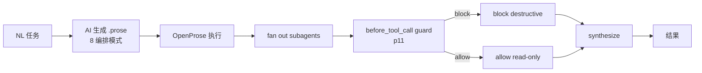

单人项目 · WIP · 部分已发布/部分已重置，见状态矩阵

# oh-my-matrix (omm)


[](LICENSE)
[](https://github.com/TeFuirnever/oh-my-matrix/actions/workflows/ci.yml)

面向 OpenClaw 宿主的 Dynamic Workflows skill + `before_tool_call` subagent 守卫。

oh-my-matrix 不是终端开发者 CLI，也没有根级 npm 安装入口。它面向 OpenClaw 集成者/宿主项目，交付 `skill/dynamic-workflows/` 与 `@openclaw/*` 库/插件源码：让宿主把 Dynamic Workflows skill 挂入 OpenClaw skills 目录，并在 gateway 注册 `@openclaw/dynamic-workflows` 运行时守卫。

当前根仓库版本为 `0.7.2`（[`package.json`](package.json)）。截至 2026-06-28，项目仍是单人 WIP，GitHub star / release 均为 0；README 不把这些数字包装成成熟度证据。

## 集成三切片

| 切片 | 集成接口 | 代码/文档 |
|---|---|---|
| 集成接口 | `decidePermission` / `classifyCommand` / audit API | [`packages/permission-policy/`](packages/permission-policy/) (`@openclaw/permission-policy`) |
| 运行时契约 | `before_tool_call` priority 11 / fail-closed / `defaultDeny` for `:subagent:` shell commands | [`packages/dynamic-workflows/`](packages/dynamic-workflows/) (`@openclaw/dynamic-workflows`), [ADR-012](docs/adr/012-dynamic-workflows-plugin-extraction.md), [ADR-013](docs/adr/013-permission-policy-library.md) |
| skill 内容 | 8 编排模式 / 自然语言任务生成 `.prose` 工作流 | [`skill/dynamic-workflows/SKILL.md`](skill/dynamic-workflows/SKILL.md), [ADR-009](docs/adr/009-dynamic-workflows-via-openprose.md) |

## 状态矩阵

| 交付物 | ADR/路径 | 状态 |
|---|---|---|
| Dynamic Workflows skill 包：586 行 `SKILL.md`，覆盖 fan-out-reduce / pipeline / adversarial-verify / loop-until-dry / routing / tournament / generate-and-filter / duel-loop | [`skill/dynamic-workflows/SKILL.md`](skill/dynamic-workflows/SKILL.md), [ADR-009](docs/adr/009-dynamic-workflows-via-openprose.md) | ✅ shipped |
| `@openclaw/dynamic-workflows`：独立 subagent runtime guard plugin，注册 `before_tool_call` priority 11 | [`packages/dynamic-workflows/`](packages/dynamic-workflows/), [ADR-012](docs/adr/012-dynamic-workflows-plugin-extraction.md) | ✅ shipped |
| `@openclaw/permission-policy`：守卫原语库，提供 `decidePermissionForEvent`、`decidePermission`、`classifyCommand`、audit persister | [`packages/permission-policy/`](packages/permission-policy/), [ADR-013](docs/adr/013-permission-policy-library.md) | ✅ shipped |
| `@openclaw/autopilot` canonical 源码托管：omm 保存源码，消费方以 vendoring / packed package 方式使用 | [`packages/autopilot/`](packages/autopilot/), [ADR-010](docs/adr/010-autopilot-source-hosting.md) | 🔶 partial |
| v0.x team 编排实现 | [`docs/archive/`](docs/archive/), [ADR-008](docs/adr/008-delegation-to-host.md), [ADR-009](docs/adr/009-dynamic-workflows-via-openprose.md) | 🔶 partial / 已重置为历史记录 |
| tokenize-based 守卫已知绕过：redirect 写 `>file`、未知非 shell 框架工具、引号内 split 过度拦截 | [docs/fixes/runtime-guard-event-shape.md](docs/fixes/runtime-guard-event-shape.md#known-limitations-tokenize-based-post-review-2026-06-28) | ⛔ limitation |

## 集成步骤

1. 挂载 [`skill/dynamic-workflows/`](skill/dynamic-workflows/) 到宿主的 OpenClaw skills 目录，让 agent 可以加载 Dynamic Workflows skill。
2. 在宿主 gateway 注册 [`@openclaw/dynamic-workflows`](packages/dynamic-workflows/) 插件，使其 `before_tool_call` hook 以 priority 11 运行。
3. 确认宿主已启用 OpenProse 运行时；omm 的 skill 负责教 agent 生成 `.prose`，执行由宿主的 OpenProse 提供，见 [ADR-009](docs/adr/009-dynamic-workflows-via-openprose.md)。
4. 对 `packages/autopilot/`、`packages/dynamic-workflows/`、`packages/permission-policy/` 的源码变更，先运行对应 package 测试，再走宿主内部部署/刷新流程；`packages/autopilot/` 是托管源码，不是 omm 的独立终端入口，见 [ADR-010](docs/adr/010-autopilot-source-hosting.md)。

## 设计原则

- **Subagent 须有运行时守卫。** Dynamic Workflows 生成的 `.prose` 会扇出 subagent；守卫必须在 gateway `before_tool_call` 层拦截，而不是只依赖 prompt 约束。见 [ADR-011](docs/adr/011-runtime-workflow-guard.md)、[ADR-012](docs/adr/012-dynamic-workflows-plugin-extraction.md)、[ADR-013](docs/adr/013-permission-policy-library.md)。
- **自主循环委托宿主。** omm 删除自建 ralph/autopilot/goal 方向，把连续自主循环交给宿主已有能力。见 [ADR-008](docs/adr/008-delegation-to-host.md)。
- **运行时由 OpenProse 提供，不重复建设。** omm 交付 skill 包，教 agent 生成 `.prose`；编译、执行、fan-out 与状态由 OpenProse 负责。见 [ADR-009](docs/adr/009-dynamic-workflows-via-openprose.md)。
- **托管 canonical 源码，消费方 vendoring。** `packages/autopilot/` 是 `@openclaw/autopilot` 的 canonical 源码位置；消费方通过打包/ vendoring 刷新自身 bundled plugin。见 [ADR-010](docs/adr/010-autopilot-source-hosting.md)。

## 采用 `@openclaw/dynamic-workflows` vs 手写 `before_tool_call` 守卫

| 方案 | 成本 | 风险 | 锁定 |
|---|---|---|---|
| 采用 `@openclaw/dynamic-workflows` | 需要接入一个 OpenClaw gateway plugin，并同步 `@openclaw/permission-policy` | 复用已验证的真实 `event.params.command` 解析、operator split、`defaultDeny` subagent 策略；仍受 tokenize 边界限制 | 绑定 OpenClaw hook 形状与 `:subagent:` session key 约定 |
| 手写 `before_tool_call` 守卫 | 初始代码少，但要自行维护 command extraction、分类、audit、priority、fail-closed 策略 | 容易重复 2026-06-28 的 event-shape fail-open 问题，见 [runtime guard fix spec](docs/fixes/runtime-guard-event-shape.md) | 可按宿主改写，但需要自行承担 OpenClaw 事件形状漂移 |

## 架构流



## 运行时守卫

[`@openclaw/dynamic-workflows`](packages/dynamic-workflows/) 在 `before_tool_call` priority 11 执行，只对 `:subagent:` 会话生效。它读取真实 OpenClaw 事件的 `event.params.command`，按 shell 操作符 `&&` / `&` / `|` / `;` / 换行拆段逐段分类，并在 subagent shell 命令上使用 `defaultDeny`。

守卫会拦截 destructive git（`reset --hard` / force-push / `clean` / history rewrite）、文件清除（`rm` / `find -delete`）、credential、system write、shell substitution（`$()` / backticks / process substitution）、wrapper-exec（例如 `npx`）。2026-06-28 的 live e2e 闭环已记录真实 subagent 被真实 block 的 audit 证据，见 [docs/fixes/runtime-guard-event-shape.md](docs/fixes/runtime-guard-event-shape.md)。

## 已知局限

- 守卫是 tokenize-based，不是完整 shell parser；redirect 写 `>file` 不建模，见 [known limitations](docs/fixes/runtime-guard-event-shape.md#known-limitations-tokenize-based-post-review-2026-06-28)。
- 未知非 shell 框架工具默认按 toolName 分类；未 allowlist 的破坏性框架工具需要宿主继续收紧，见 [runtime guard event-shape fix](docs/fixes/runtime-guard-event-shape.md)。
- 引号内 split 可能被 `&&` / `|` 等字符误伤，表现为 fail-closed 过度拦截，不是静默放行，见 [docs/fixes/runtime-guard-event-shape.md](docs/fixes/runtime-guard-event-shape.md)。

## 阅读地图

| 文档 | 用途 |
|---|---|
| [docs/architecture.md](docs/architecture.md) | 当前架构总览与历史重置说明 |
| [docs/roadmap.md](docs/roadmap.md) | 路线图；旧 Phase 记录需按 ADR 状态阅读 |
| [CONTEXT.md](CONTEXT.md) | 仓库领域语言与当前方向 |
| [docs/adr/](docs/adr/) | 委托、OpenProse、源码托管、运行时守卫决策 |
| [docs/fixes/](docs/fixes/) | 修复 spec，尤其是 runtime guard event shape |
| [docs/archive/](docs/archive/) | v0.x team/MCP/contract 设计记录；作为历史保留 |

## 仓库布局

```text
.
├── docs/                  架构、roadmap、ADR、fix spec、archive
├── packages/              @openclaw/* 库与插件源码
│   ├── autopilot/         @openclaw/autopilot canonical 源码（托管）
│   ├── dynamic-workflows/ @openclaw/dynamic-workflows subagent guard plugin
│   └── permission-policy/ @openclaw/permission-policy 守卫原语库
├── skill/                 OpenClaw skills；当前核心为 dynamic-workflows
├── website/               VitePress 文档站
└── scripts/               当前无部署脚本；宿主部署步骤不在本仓库
```

## License

[MIT](LICENSE)
