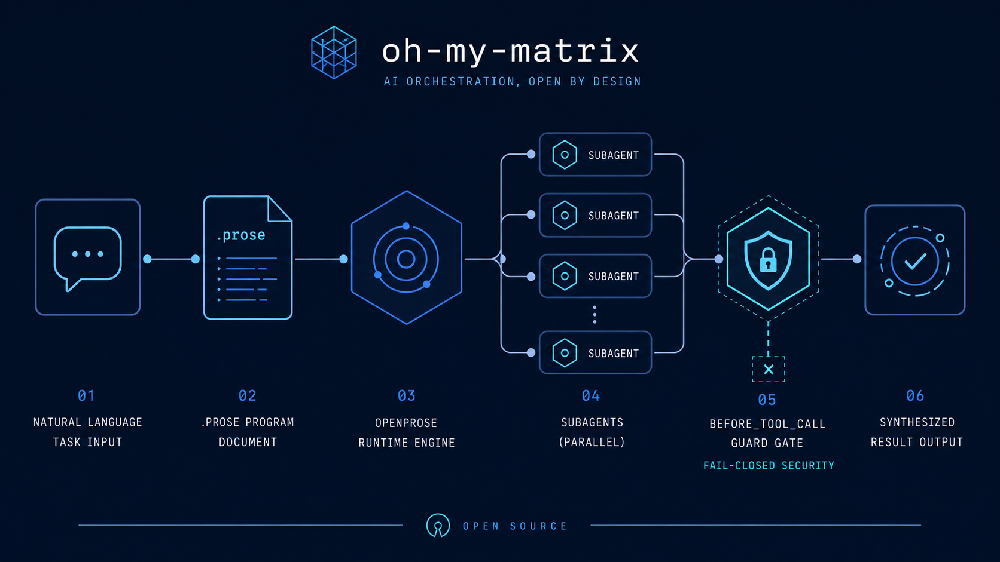
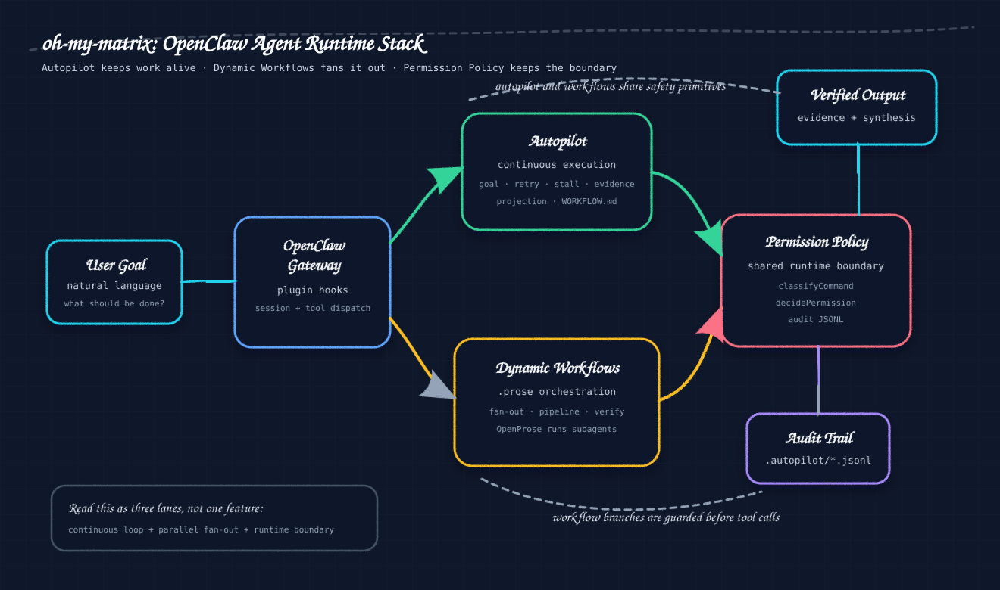
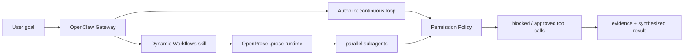

[English](README.en.md) | **简体中文**

单人项目 · WIP · OpenClaw 宿主集成栈

# oh-my-matrix (omm)



[](LICENSE)
[](https://github.com/TeFuirnever/oh-my-matrix/actions/workflows/ci.yml)
[](https://www.npmjs.com/package/@oh-my-matrix/autopilot)
[](https://github.com/TeFuirnever/oh-my-matrix/releases)
[](https://deepwiki.com/TeFuirnever/oh-my-matrix)

**把 OpenClaw 变成可持续工作的 autonomous agent runtime stack。**

oh-my-matrix 面向 OpenClaw 宿主和集成者，交付三块能力：

- **Autopilot**: 长程任务连续执行，带目标、重试、stall 检测、证据门和状态投影。
- **Dynamic Workflows**: AI 根据自然语言生成 `.prose` 多 agent 编排程序，经 OpenProse 执行 fan-out / pipeline / adversarial verification。
- **Permission Policy**: `before_tool_call` 运行时安全原语，供 autopilot 与 workflow subagent 共用。

它不是终端用户 CLI，也不是独立 SaaS。它是给 OpenClaw 宿主加载、打包、验证的插件/skill 源码仓库。根仓库版本为 `0.8.0`，核心包版本见各 `packages/*/package.json`。

> 当前成熟度: WIP。`@oh-my-matrix/*` packages 已发布到 npm（public）；其中 `@oh-my-matrix/autopilot` 作为 OpenClaw 宿主的 hosted plugin，部署到消费方宿主仍需内部 refresh / vendoring 流程。README 不使用未验证的 star、下载量、用户评价作为成熟度证据。

## 为什么需要它

单个 agent 可以完成一次回复。真正的长程开发需要三件事：

1. **持续性**: 任务跨 turn、跨工具错误、跨重试仍能回到目标。
2. **并行性**: 大任务可以拆成多个 subagent 分支，最后收敛成一个结果。
3. **边界**: subagent 和自动循环必须在运行时被守住，而不是只靠 prompt 约束。

omm 把这三件事拆成可验证的 OpenClaw 模块，而不是做一个黑盒自动化脚本。

## 模块矩阵

| 模块 | 做什么 | 当前状态 | 路径 |
|---|---|---:|---|
| `@oh-my-matrix/autopilot` | 连续执行插件。管理目标、状态机、重试队列、stall 检测、token 预算、证据门、projection、`WORKFLOW.md` 配置和 11 个 OpenClaw hooks | ✅ source hosted, tests present | [`packages/autopilot/`](packages/autopilot/) |
| `@oh-my-matrix/dynamic-workflows` | Workflow subagent 运行时守卫。注册 `before_tool_call` priority 11，对 `:subagent:` 会话 fail-closed 拦截危险操作 | ✅ shipped source | [`packages/dynamic-workflows/`](packages/dynamic-workflows/) |
| `@oh-my-matrix/permission-policy` | 共享权限原语。提供 `classifyCommand`、`decidePermission`、`decidePermissionForEvent`、audit persistence | ✅ shipped source | [`packages/permission-policy/`](packages/permission-policy/) |
| `dynamic-workflows` skill | 教 agent 何时生成 `.prose`，如何选择 8 种编排模式，如何验证与汇总结果 | ✅ shipped skill | [`packages/dynamic-workflows/skill/`](packages/dynamic-workflows/skill/) |
| 历史 v0.x team/MCP 实现 | 早期设计与实现记录，已移除，不再作为当前运行面 | 📦 archived | [`docs/archive/`](docs/archive/) |

## 架构





### Autopilot: 长程连续执行

`@oh-my-matrix/autopilot` 是 OpenClaw-native continuous execution 插件。它不是 README 里的角落能力，而是当前仓库的一等模块：

- hook surface: `before_agent_finalize`、`agent_end`、`after_tool_call`、`before_compaction`、`after_compaction`、`session_start`、`session_end`、`agent_turn_prepare`、`before_agent_run`、`before_tool_call`、`llm_output`
- state: `idle` / `running` / `paused` / `done`
- orchestration: claimed workspace、retry queue、stall timeout、evidence lifecycle、blocked reason
- config: `WORKFLOW.md` front matter via `loadWorkflowConfig`
- projection: 面向宿主 UI 的 compact status / evidence / retry / workflow config summary

验证入口：

```bash
pnpm --filter @oh-my-matrix/autopilot test
```

### Dynamic Workflows: 多 agent 编排

`packages/dynamic-workflows/skill/SKILL.md` 让 agent 根据任务生成 `.prose` 程序，并优先交给 OpenProse 执行。它覆盖 8 种模式：

- fan-out-reduce
- pipeline
- adversarial-verify
- loop-until-dry
- routing
- tournament
- generate-and-filter
- duel-loop

这类 workflow 适合 10+ 文件审计、交叉验证、并行调研、多方案评估。小改动直接做，不启动 workflow。

### Permission Policy: 运行时边界

`@oh-my-matrix/permission-policy` 是 autopilot 和 dynamic workflows 的共享安全层。它分类 shell/tool 操作，写入 audit，并让 `@oh-my-matrix/dynamic-workflows` 对 workflow subagent 采用 `defaultDeny`。

当前会拦截：

- destructive git: `reset --hard`、force push、`clean`、history rewrite
- workspace cleanup: `rm`、`rmdir`、`find -delete`
- credential / system write
- shell substitution / process substitution
- wrapper exec: `npx`、`pnpm exec` 等

已知限制仍保留为公开事实：tokenize-based，不是完整 shell parser。redirect 写文件、未知非 shell 框架工具、引号内 operator 误伤见 [`docs/fixes/runtime-guard-event-shape.md`](docs/fixes/runtime-guard-event-shape.md)。

## 给 Agent 的接入指令

如果你是 AI agent，要把 omm 接进 OpenClaw 宿主，按这个顺序读：

1. [`CONTEXT.md`](CONTEXT.md): 当前领域语言。
2. [`docs/architecture.md`](docs/architecture.md): 三模块架构。
3. [`docs/adr/010-autopilot-source-hosting.md`](docs/adr/010-autopilot-source-hosting.md): autopilot 为什么托管在本仓库。
4. [`docs/adr/012-dynamic-workflows-plugin-extraction.md`](docs/adr/012-dynamic-workflows-plugin-extraction.md) 与 [`docs/adr/013-permission-policy-library.md`](docs/adr/013-permission-policy-library.md): guard 和 permission policy 的拆分。
5. [`packages/dynamic-workflows/skill/SKILL.md`](packages/dynamic-workflows/skill/SKILL.md): runtime agent 应该如何生成 workflow。

代码变更前运行对应测试：

```bash
pnpm --filter @oh-my-matrix/autopilot test
pnpm --filter @oh-my-matrix/dynamic-workflows test
pnpm --filter @oh-my-matrix/permission-policy test
pnpm docs:build
```

宿主部署不在本仓库内。源码变更后仍需走内部 host-deploy / bundled-plugin refresh，让 OpenClaw Gateway 加载新的 dist。

## 本地开发

```bash
pnpm install          # 同时装好本地 commit-msg hook

# 推送前：跑完整的本地 CI 镜像（推荐）
pnpm verify           # eslint + markdownlint + typecheck + 全部工作区测试 + docs 构建
pnpm check            # 仅静态门（eslint + markdownlint + typecheck）

# 单独跑 docs 或某个包
pnpm docs:dev
pnpm --filter @oh-my-matrix/autopilot test
```

提交须遵循 Conventional Commits（本地 hook + CI 双重看护）。多 gate harness 的全貌与如何新增 gate 见 [`CONTRIBUTING.md`](CONTRIBUTING.md)、`harness` skill 与 [`docs/design/dev-harness.md`](docs/design/dev-harness.md)。

## 发布到 npm（维护者）

改 `packages/<pkg>/package.json` 版本号后，在**自己的终端**发布（不要用 Claude 的 `!`）：

```bash
pnpm --filter @oh-my-matrix/autopilot publish --access public
pnpm --filter @oh-my-matrix/dynamic-workflows publish --access public
pnpm --filter @oh-my-matrix/permission-policy publish --access public
```

- **2FA 必须开着**：`@oh-my-matrix` org 强制发布者开 2FA，关掉会被 E403 锁死。npm 交互式要 OTP（从认证 App 读 6 位码敲进去）。
- **在自己终端跑**：Claude `!` + `--otp=` 容易撞 OTP 30 秒时效和权限分类器；本地交互最顺。
- **不能重发同版本**：npm 版本不可变，改了内容必须 bump（哪怕只 patch）。`pnpm --filter <pkg> pack` 可预览 tarball。

## 项目状态

| 事项 | 状态 |
|---|---|
| 根仓库公开 release | v0.8.0（GitHub Release）|
| npm public package | 已发布 `@oh-my-matrix/*`（permission-policy 0.1.1 / autopilot 3.0.0 / dynamic-workflows 0.1.2）|
| CI / Harness | GitHub Actions 4 gate（lint / typecheck / commitlint / test）+ 本地 `pnpm verify` 镜像 |
| 依赖扫描 | Dependabot 已启用（`.github/dependabot.yml`） |
| 在线站点 | https://tefuirnever.github.io/oh-my-matrix/ — 手绘 landing（根）+ 文档（`/docs/`，VitePress 源见 [`website/`](website/)）|
| 安全策略 | [`SECURITY.md`](SECURITY.md) |
| 贡献指南 | [`CONTRIBUTING.md`](CONTRIBUTING.md) |
| 行为准则 | [`CODE_OF_CONDUCT.md`](CODE_OF_CONDUCT.md) |

## 路线图

近期优先级：

1. **Autopilot 一等公开叙事**: README、docs、website 与源码能力保持一致。
2. **Host deploy 可复现化**: 把内部 refresh / pack / install / smoke check 记录成可执行 runbook。
3. **Workflow visual observability**: 为 `.prose` fan-out / evidence / blocked calls 提供宿主 UI 可视化契约。
4. **Permission policy hardening**: 从 tokenize-based 向更完整的 shell model 演进，降低 redirect 与引号边界风险。
5. **Release readiness**: 明确哪些 packages 可以公开发布，哪些仍是 host-internal。

完整路线图见 [`docs/roadmap.md`](docs/roadmap.md)。

## 贡献

欢迎从文档、测试、host integration runbook 和安全用例开始。请先读 [`CONTRIBUTING.md`](CONTRIBUTING.md)。安全问题不要开 public issue，按 [`SECURITY.md`](SECURITY.md) 报告。

## License

[MIT](LICENSE) — 版权归 oh-my-matrix contributors。本项目人工主导、AI 辅助开发,所有贡献经人工审查并由维护者持有。
