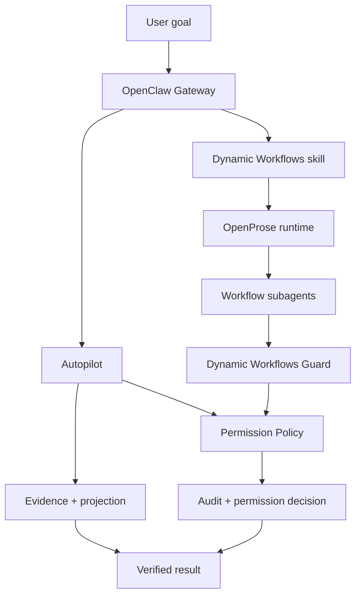

# Architecture

oh-my-matrix is an OpenClaw agent runtime stack with three active surfaces:

1. **Autopilot**: continuous execution for long-running goals.
2. **Dynamic Workflows**: `.prose` multi-agent orchestration through OpenProse.
3. **Permission Policy**: shared runtime safety primitives.

## Autopilot

`packages/autopilot/` owns long-running task state: goals, retries, stall detection, evidence, token budget, projection, and `WORKFLOW.md` config.

## Dynamic Workflows

`skill/dynamic-workflows/` teaches the agent to generate `.prose`. `packages/dynamic-workflows/` guards spawned subagents at `before_tool_call` priority 11.

## Permission Policy

`packages/permission-policy/` classifies commands, decides permissions, extracts real hook event commands, and writes audit entries.

For the full architecture narrative, read the repository file [`docs/architecture.md`](https://github.com/TeFuirnever/oh-my-matrix/blob/master/docs/architecture.md).
